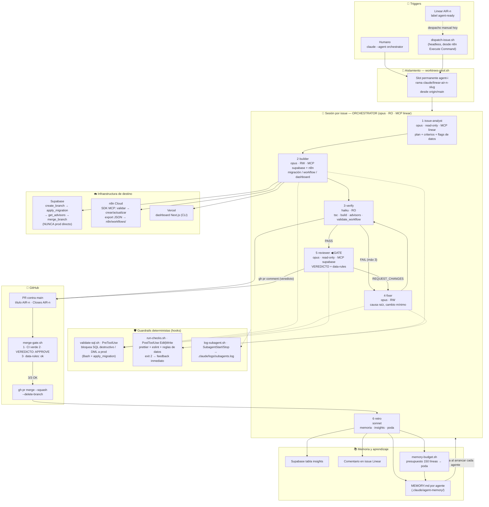
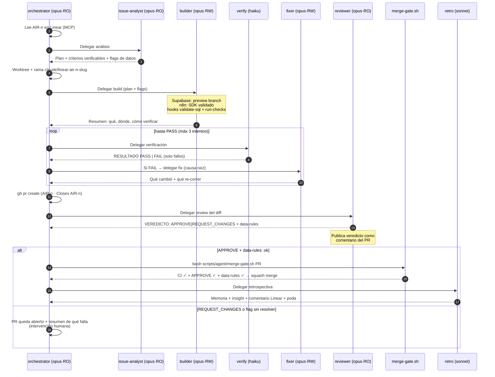
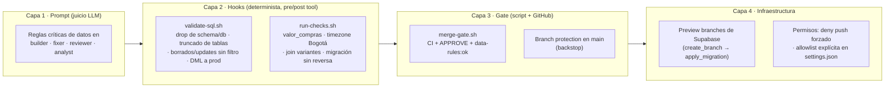
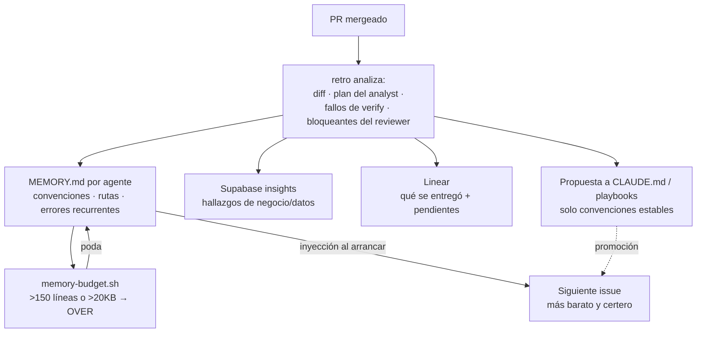
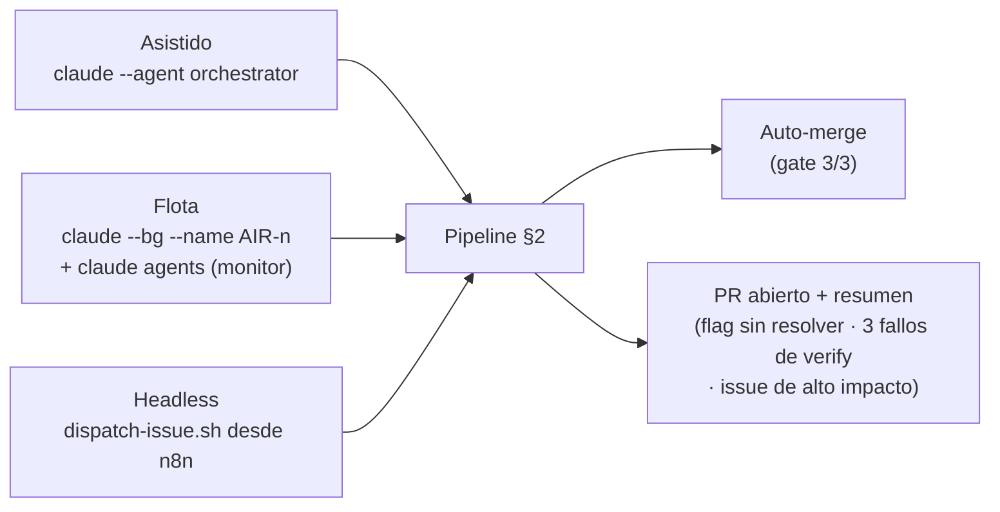

# Mapa de arquitectura — Flota autónoma de desarrollo

> Diagrama vivo del sistema implementado en `.claude/agents/`, `.claude/hooks/`, `.claude/settings.json` y `scripts/agent/`. Complementa `docs/agentes/README.md` (instalación/uso) y `HANDOFF.md` (estado de sesión).

---

## 1. Mapa global del sistema

---

## 2. Pipeline por issue (secuencia)

---

## 3. Roster de agentes

| # | Agente | Modelo | Escritura | MCP | Hooks propios | Rol |
|---|--------|--------|-----------|-----|---------------|-----|
| 1 | `orchestrator` | opus | ❌ (sin Write/Edit) | linear | — | Coordina el pipeline; único que delega |
| 2 | `issue-analyst` | opus | ❌ | linear | — | Plan + criterios verificables + flags de riesgo de datos |
| 3 | `builder` | opus | ✅ | supabase, n8n-mcp, n8n | validate-sql (Pre) + run-checks (Post) | Implementa la mínima superficie; memoria de proyecto |
| 4 | `verify` | haiku | ❌ (no edita) | supabase, n8n-mcp | — | Señal limpia PASS/FAIL; aísla salida ruidosa |
| 5 | `reviewer` | opus | ❌ (+ sin apply_migration) | supabase | validate-sql (Pre) | **Compuerta del auto-merge**; veredicto con doble token |
| 6 | `fixer` | opus | ✅ | supabase, n8n-mcp, n8n | validate-sql (Pre) + run-checks (Post) | Causa raíz, cambio mínimo; memoria de proyecto |
| 7 | `retro` | sonnet | ✅ | supabase, linear | — | Destila aprendizajes; bibliotecario y poda de memoria |

**Restricción estructural:** un subagente no puede generar otro → toda delegación pasa por el orchestrator (hub-and-spoke, sin cadenas ocultas).

---

## 4. Guardrails — capas de defensa

**Reglas de datos protegidas en las 3 primeras capas** (prompt + regex + veredicto):
1. `valor_compras` ≠ revenue → usar `roas_real` / `v_meta_ads_roas_real`
2. Ventas: `ordered_at AT TIME ZONE 'America/Bogota'` + `estado_pago='paid'`
3. Productos: join `venta_items → variantes → productos` (nunca `producto_id` directo)
4. Ciudad: `JOIN clientes c ON c.id = v.cliente_id`
5. Margen: verificar `cobertura_cogs`
6. Sin columnas GENERATED STORED en INSERT/UPSERT

### Checks deterministas en CI (Capa 3)

Además del veredicto del reviewer, el job `CI` (`.github/workflows/ci.yml`) corre guardrails determinis­tas que **bloquean el merge** sin juicio LLM:

| Check (job CI) | Script | Qué pesca |
|----------------|--------|-----------|
| `data-rules` | `scripts/agent/check-data-rules.sh --diff origin/main` | Las 6 reglas de datos sobre el diff (valor_compras, timezone, joins, GENERATED, …) |
| `docstring-rpc-loop` | `scripts/agent/check-docstring-rpc-loop.sh --diff origin/main` | Drift docstring↔cuerpo en las RPCs del loop de insights (AIR-135) |
| `n8n-sync` | `scripts/check-transform-ads-sync.sh` | Bloque de mapeo "Transform Ads Data" idéntico entre Backfill y Daily (AIR-95) |
| `n8n-graph-parity` | `scripts/agent/check-n8n-graph-parity.sh` | Paridad `nodes` ↔ `activeVersion.nodes` en nodos críticos de seguridad (AIR-140) |

#### `n8n-graph-parity` — patrón `nodes` vs `activeVersion.nodes`

Algunos exports de n8n incluyen una clave top-level `activeVersion: { nodes, connections }` que es una **copia** del grafo además de `w.nodes`/`w.connections`. **n8n EJECUTA `activeVersion.nodes`**, no necesariamente `w.nodes`. Si alguien edita un `jsCode` (o el body de la llamada a Claude) solo en `w.nodes`, la copia que realmente corre queda *stale*.

Para los **nodos críticos de seguridad** (`Build Prompt*`, `Claude*`, `Anthropic*`, `Parse Claude*`, y httpRequest a la API de Anthropic) esa divergencia es una **regresión de prompt-injection silenciosa**: la protección anti-injection puede estar en la copia editada pero NO en la que se ejecuta. Caso real que originó este check: AIR-119 sanitizó el `snapshot` (texto libre de Meta/Shopify) solo en `w.nodes`; `activeVersion.nodes` de `E5A_Loop_Weekly_Analysis.json` quedó inyectando el snapshot CRUDO.

El detector compara byte-a-byte (sha256, JSON canónico) el objeto `parameters` de cada nodo crítico entre ambas copias; falla con `exit 1` y diff legible si divergen o si un nodo crítico existe en solo una copia. **El fix del workflow no pertenece a este check** — el detector solo lo pesca y enruta al issue del workflow (E5A → AIR-119). No debilites el check para pasar verde.

---

## 5. Loop de aprendizaje (memoria acumulativa)

Principio: **cada issue resuelto hace al siguiente más barato.** Si un aprendizaje ya está en `CLAUDE.md`, se elimina de la memoria del agente (sin duplicar). Lo que el reviewer caza repetidamente es candidato a regla determinista en `run-checks.sh`.

---

## 6. Scripts de soporte

| Script | Quién lo usa | Qué hace |
|--------|--------------|----------|
| `scripts/agent/dispatch-issue.sh AIR-n` | n8n (Execute Command) / humano | Entrypoint headless: lanza `claude -p --agent orchestrator --permission-mode auto` para el pipeline completo |
| `scripts/agent/worktrees-pool.sh setup\|reset\|list` | humano / flota | Pool de N worktrees permanentes (`../Aire-de-Agua-wt/agent-i`, rama `agent/pool-i`); tras merge → reset a `origin/main` |
| `scripts/agent/merge-gate.sh PR` | orchestrator (solo tras APPROVE) | Reverifica las 3 condiciones y mergea con squash; si falta una, no mergea |
| `scripts/agent/memory-budget.sh` | retro | Reporta tamaño de cada `MEMORY.md` y marca `OVER` para poda |

---

## 7. Decisiones de integración (MCP vs CLI)

| Sistema | Vía | Razón |
|---------|-----|-------|
| Supabase | **MCP** (`create_branch`, `apply_migration`, `get_advisors`) | No hay config local del CLI; el camino establecido es MCP |
| n8n | **MCP** (SDK: reference → nodes → types → validate → create) | Workflows como código vía SDK |
| Linear | **MCP** | No hay buen CLI |
| GitHub | **CLI `gh`** | CLI maduro; menos definiciones de tools en contexto |
| Vercel | **CLI `vercel`** | Ídem |
| Typecheck/build | **CLI `tsc` / `next`** | Ídem |

MCP **acotado por subagente** (frontmatter `mcpServers`) → el hilo principal no carga tools que no usa → prefijo de contexto estable → KV-cache caliente.

> **Restricción verificada en entorno web/remoto (sesión AIR-71/119/67/97):** los subagentes con
> lista `tools:` positiva (builder, verify, reviewer, retro, fixer) **no reciben herramientas MCP**
> aunque el frontmatter declare `mcpServers`. Solo los agentes "All tools except…" (issue-analyst,
> orchestrator — cuyo frontmatter NO usa lista positiva) tienen MCP garantizado. Consecuencia:
> el ORQUESTADOR ejecuta las operaciones MCP críticas (apply_migration, validate_workflow,
> get_advisors); el builder solo puede autorar archivos.

> **Restricción de infraestructura (plan Free):** `create_branch` en Supabase devuelve
> `PaymentRequired` (`vnctmzsgemefgbtjctlo` sin plan Pro). Preview branches no disponibles.
> Mitigación activa: verificación estática de RPCs via `pg_get_functiondef` + tests sintéticos en
> el PR para que el humano ejecute al aplicar.

---

## 8. Modos de operación

**Issues que NO van por auto-merge** (requieren humano): decisiones de producto, escrituras a `ventas` de prod, cambios que gobiernan pauta con dinero real (p.ej. AIR-65), consentimientos. Ver `HANDOFF.md`.

---

## 9. Gaps — estado (actualizado en esta rama)

| # | Gap | Estado |
|---|-----|--------|
| 1 | CI inexistente | ✅ Resuelto — `.github/workflows/ci.yml` (checks `data-rules` + `dashboard`) |
| 2 | Veredicto sin anclar | ✅ Resuelto — `merge-gate.sh` v2 exige `sha: <headRefOid>` + último veredicto + autor opcional (`GATE_REVIEWER_LOGIN`) |
| 3 | Reviewer podía escribir vía `execute_sql` | ✅ Mitigado — `disallowedTools` lo bloquea; falta paso manual `supabase-ro` (ver `AUTONOMIA.md` §6.3) |
| 4 | Branch protection en `main` | ⏳ Manual — comando listo en `AUTONOMIA.md` §6.2 |
| 5 | Drift n8n ↔ repo | 📋 Diseñado — señal del Sentinela (`AUTONOMIA.md` §3) |
| 6 | Trigger Linear→dispatch | ✅ Resuelto — `scripts/agent/fleet-poll.sh` + cron (`AUTONOMIA.md` §4) |
| 7 | Carril `human-gate` formal | ✅ Resuelto — escalera de autonomía: analyst decide → orchestrator etiqueta → gate condición 0 |

Extras de esta rama: contador determinista de reintentos (`attempt.sh`), reglas de datos como fuente única (`check-data-rules.sh`, usada por hook + CI), regla de graduación en `retro`, guard anti prompt-injection en `issue-analyst`. Diseño completo de autonomía: `docs/agentes/AUTONOMIA.md`.
| 8 | MCP no llega a subagentes con allowlist `tools:` positiva en entorno web/remoto | Documentado — el orquestador ejecuta las ops MCP; builder/verify/reviewer solo autoran archivos. Ver §7. |
| 9 | Supabase branching deshabilitado (plan Free) | Documentado — mitigación: verificación estática + tests sintéticos en PR. Ver §7. |
| 10 | Drift docstring/cuerpo en RPCs del loop de insights | Candidato a regla `check-data-rules.sh` (AIR-127) — aún no implementado. |
