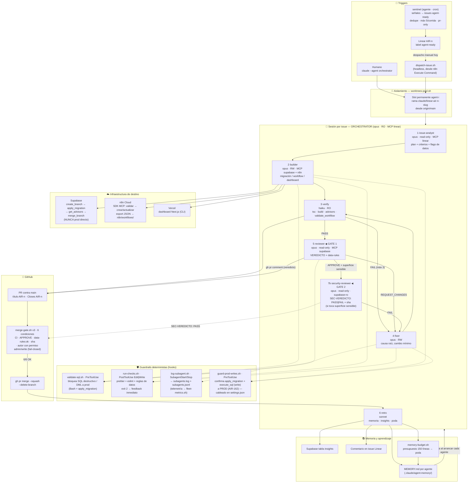
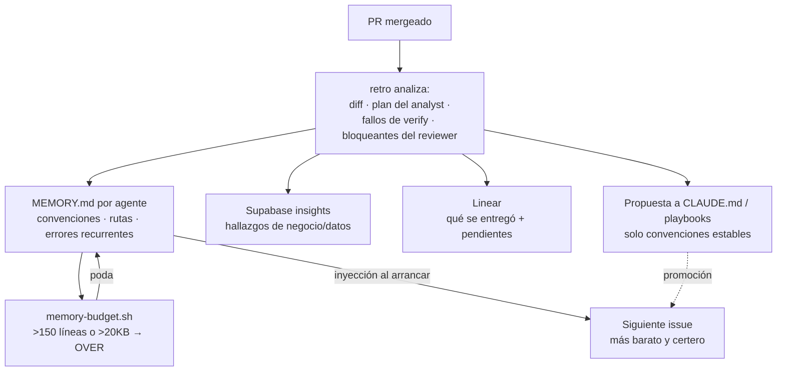
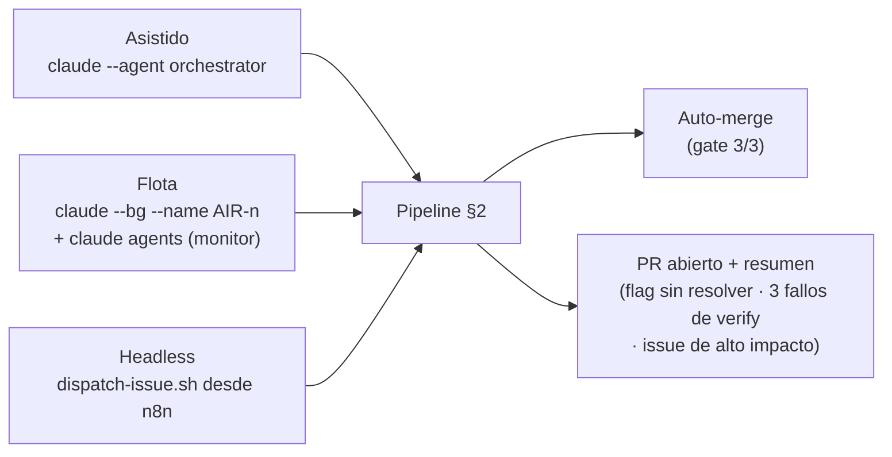

# Mapa de arquitectura — Flota autónoma de desarrollo

> Diagrama vivo del sistema implementado en `.claude/agents/`, `.claude/hooks/`, `.claude/settings.json` y `scripts/agent/`. Complementa `docs/agentes/README.md` (instalación/uso) y `HANDOFF.md` (estado de sesión).

---

## 1. Mapa global del sistema



---

## 2. Pipeline por issue (secuencia)

```mermaid
sequenceDiagram
    autonumber
    participant O as orchestrator (opus·RO)
    participant IA as issue-analyst (opus·RO)
    participant B as builder (opus·RW)
    participant V as verify (haiku)
    participant FX as fixer (opus·RW)
    participant R as reviewer (opus·RO)
    participant SR as security-reviewer (opus·RO)
    participant G as merge-gate.sh
    participant RT as retro (sonnet)

    O->>O: Lee AIR-n en Linear (MCP)
    O->>IA: Delegar análisis
    IA-->>O: Plan + criterios verificables + flags de datos
    O->>O: Worktree + rama claude/linear-air-n-slug
    O->>B: Delegar build (plan + flags)
    Note over B: Supabase: preview branch<br/>n8n: SDK validado<br/>hooks validate-sql + run-checks
    B-->>O: Resumen: qué, dónde, cómo verificar
    loop hasta PASS (máx 3 intentos)
        O->>V: Delegar verificación
        V-->>O: RESULTADO PASS | FAIL (solo fallos)
        O->>FX: Si FAIL → delegar fix (causa raíz)
        FX-->>O: Qué cambió + qué re-correr
    end
    O->>O: gh pr create (AIR-n · Closes AIR-n)
    O->>R: Delegar review del diff
    R-->>O: VEREDICTO: APPROVE|REQUEST_CHANGES + data-rules
    Note over R: Publica veredicto como<br/>comentario del PR
    alt APPROVE + data-rules: ok
        opt diff toca n8n prompt / scripts/agent / .claude / .github/workflows / RPC de prompt
            O->>SR: 7b · red-team adversarial (segunda compuerta OBLIGATORIA)
            SR-->>O: SEC-VEREDICTO: PASS|FAIL + sha anclado
            Note over SR: FAIL → PR abierto, no gate;<br/>vuelve a fixer si aplica
        end
        O->>G: bash scripts/agent/merge-gate.sh PR
        G-->>O: 6/6 (CI · APPROVE · data-rules · sha · autor con permiso) → squash merge
        O->>RT: Delegar retrospectiva
        RT-->>O: Memoria + insight + comentario Linear + poda
    else REQUEST_CHANGES / SEC-VEREDICTO FAIL / flag sin resolver
        O->>O: PR queda abierto + resumen de qué falta<br/>(intervención humana)
    end
```

---

## 3. Roster de agentes

| # | Agente | Modelo | Escritura | MCP | Hooks propios | Rol |
|---|--------|--------|-----------|-----|---------------|-----|
| 1 | `orchestrator` | opus | ❌ (sin Write/Edit) | linear | — | Coordina el pipeline; único que delega |
| 2 | `issue-analyst` | opus | ❌ | linear | — | Plan + criterios verificables + flags de riesgo de datos |
| 3 | `builder` | opus | ✅ | supabase, n8n-mcp, n8n | validate-sql (Pre) + run-checks (Post) + guard-prod-writes (Pre) | Implementa la mínima superficie; memoria de proyecto |
| 4 | `verify` | haiku | ❌ (`disallowedTools` Write/Edit) | supabase, n8n-mcp | — | Señal limpia PASS/FAIL; corre él mismo advisors/validate_workflow |
| 5 | `reviewer` | opus | ❌ (+ sin apply_migration) | supabase | validate-sql (Pre) | **Compuerta del auto-merge (GATE 1)**; veredicto con doble token |
| 6 | `fixer` | opus | ✅ | supabase, n8n-mcp, n8n | validate-sql (Pre) + run-checks (Post) + guard-prod-writes (Pre) | Causa raíz, cambio mínimo; memoria de proyecto |
| 7 | `retro` | sonnet | ✅ | supabase, linear | — | Destila aprendizajes; bibliotecario y poda de memoria |
| 8 | `security-reviewer` | opus | ❌ (read-only) | supabase-ro | validate-sql (Pre) | **Segunda compuerta (GATE 2)**; red-team adversarial de prompt-injection y debilitamiento de gates; `SEC-VEREDICTO: PASS\|FAIL` + sha anclado |
| 9 | `sentinel` | sonnet | ❌ (read-only) | linear, n8n, supabase-ro | — | Sentinela de AUTONOMIA §3 como agente: señales → issues Linear `agent-ready`, dedupe, máx pr-only, máx 5 issues/corrida; corre por cron |

**Migración a `disallowedTools` (auditoría 2026-07-01):** `builder`, `verify`, `fixer` y `retro` pasaron de una lista `tools:` positiva a `disallowedTools:` — así SÍ reciben MCP en entorno remoto (mitiga el gap de §7). En la práctica `verify` vuelve a poder correr `get_advisors`/`validate_workflow` por sí mismo.

**GATE 2 (security-reviewer) es OBLIGATORIO** cuando el diff toca: `n8n/workflows/` con nodos de prompt, `scripts/agent/`, `.claude/`, `.github/workflows/`, o RPCs que alimentan prompts. El orchestrator lo invoca en el **paso 7b**, antes del gate.

**Restricción estructural:** un subagente no puede generar otro → toda delegación pasa por el orchestrator (hub-and-spoke, sin cadenas ocultas).

---

## 4. Guardrails — capas de defensa

```mermaid
flowchart LR
    subgraph CAPA1["Capa 1 · Prompt (juicio LLM)"]
        P1["Reglas críticas de datos en<br/>builder · fixer · reviewer · analyst"]
    end
    subgraph CAPA2["Capa 2 · Hooks (determinista, pre/post tool)"]
        P2["validate-sql.sh<br/>drop de schema/db · truncado de tablas<br/>· borrados/updates sin filtro · DML a prod"]
        P3["run-checks.sh<br/>R1 valor_compras · R2 timezone Bogotá<br/>· R3 join variantes · R5 GENERATED"]
        P8["guard-prod-writes.sh (AIR-162)<br/>confirma apply_migration + execute_sql<br/>(write) a PROD · cableado en settings.json"]
    end
    subgraph CAPA3["Capa 3 · Gate (script + GitHub)"]
        P4["merge-gate.sh v3 · 6 condiciones<br/>CI + APPROVE + data-rules:ok + sha<br/>+ autor con permiso (fail-closed)"]
        P9["security-reviewer (GATE 2)<br/>SEC-VEREDICTO en superficie sensible"]
        P5["Branch protection en main<br/>(backstop)"]
    end
    subgraph CAPA4["Capa 4 · Infraestructura"]
        P6["Preview branches de Supabase<br/>(create_branch → apply_migration)"]
        P7["Permisos: deny push forzado<br/>· allowlist explícita en settings.json"]
    end
    CAPA1 --> CAPA2 --> CAPA3 --> CAPA4
```



**Reglas de datos protegidas en las 3 primeras capas** (prompt + regex + veredicto):
1. **R1** `valor_compras` ≠ revenue → usar `roas_real` / `v_meta_ads_roas_real` (FAIL)
2. **R2** Ventas: `ordered_at AT TIME ZONE 'America/Bogota'` + `estado_pago='paid'` (FAIL)
3. **R3** Productos: join `venta_items → variantes → productos` (nunca `producto_id` directo) (FAIL)
4. **R5** Sin columnas GENERATED STORED en INSERT/UPSERT — análisis de bloque por tabla contra la lista de `CLAUDE.md` (FAIL)
5. **R6a** Ciudad sin `JOIN clientes` → `JOIN clientes c ON c.id = v.cliente_id` (WARN)
6. **R6b** Margen sin verificar `cobertura_cogs` (WARN)

### Checks deterministas en CI (Capa 3)

Además del veredicto del reviewer, el job `CI` (`.github/workflows/ci.yml`) corre guardrails determinis­tas que **bloquean el merge** sin juicio LLM:

| Check (job CI) | Script | Qué pesca |
|----------------|--------|-----------|
| `data-rules` | `scripts/agent/check-data-rules.sh --diff origin/main` | Reglas de datos sobre el diff — FAIL: R1 valor_compras, R2 timezone, R3 joins, R5 GENERATED (bloque por tabla), R7 numeración de migraciones; WARN: R6a ciudad sin `JOIN clientes`, R6b margen sin `cobertura_cogs` |
| `prompt-hygiene` | `scripts/agent/check-prompt-hygiene.sh` | Gradúa el patrón AIR-94 a determinista: en nodos críticos de n8n (ambas copias, `nodes` y `activeVersion.nodes`) exige `sanitize()` con strip total `<[^>]*>`, system prompt defensivo con "Ignora", y prohíbe el antipatrón "reporta lo sospechoso". Con selftest y allowlist ratchet (`prompt-hygiene-allowlist.txt`) |
| `docstring-rpc-loop` | `scripts/agent/check-docstring-rpc-loop.sh --diff origin/main` | Drift docstring↔cuerpo en las RPCs del loop de insights (AIR-135) |
| `n8n-sync` | `scripts/check-transform-ads-sync.sh` | Bloque de mapeo "Transform Ads Data" idéntico entre Backfill y Daily (AIR-95) |
| `n8n-graph-parity` | `scripts/agent/check-n8n-graph-parity.sh` | Paridad `nodes` ↔ `activeVersion.nodes` en nodos críticos de seguridad (AIR-140) |

#### `n8n-graph-parity` — patrón `nodes` vs `activeVersion.nodes`

Algunos exports de n8n incluyen una clave top-level `activeVersion: { nodes, connections }` que es una **copia** del grafo además de `w.nodes`/`w.connections`. **n8n EJECUTA `activeVersion.nodes`**, no necesariamente `w.nodes`. Si alguien edita un `jsCode` (o el body de la llamada a Claude) solo en `w.nodes`, la copia que realmente corre queda *stale*.

Para los **nodos críticos de seguridad** (`Build Prompt*`, `Claude*`, `Anthropic*`, `Parse Claude*`, y httpRequest a la API de Anthropic) esa divergencia es una **regresión de prompt-injection silenciosa**: la protección anti-injection puede estar en la copia editada pero NO en la que se ejecuta. Caso real que originó este check: AIR-119 sanitizó el `snapshot` (texto libre de Meta/Shopify) solo en `w.nodes`; `activeVersion.nodes` de `E5A_Loop_Weekly_Analysis.json` quedó inyectando el snapshot CRUDO.

El detector compara byte-a-byte (sha256, JSON canónico) el objeto `parameters` de cada nodo crítico entre ambas copias; falla con `exit 1` y diff legible si divergen o si un nodo crítico existe en solo una copia. **El fix del workflow no pertenece a este check** — el detector solo lo pesca y enruta al issue del workflow (E5A → AIR-119). No debilites el check para pasar verde.

---

## 5. Loop de aprendizaje (memoria acumulativa)



Principio: **cada issue resuelto hace al siguiente más barato.** Si un aprendizaje ya está en `CLAUDE.md`, se elimina de la memoria del agente (sin duplicar). Lo que el reviewer caza repetidamente es candidato a regla determinista en `run-checks.sh`.

---

## 6. Scripts de soporte

| Script | Quién lo usa | Qué hace |
|--------|--------------|----------|
| `scripts/agent/dispatch-issue.sh AIR-n` | n8n (Execute Command) / humano | Entrypoint headless: lanza `claude -p --agent orchestrator --permission-mode auto` para el pipeline completo |
| `scripts/agent/worktrees-pool.sh setup\|reset\|list` | humano / flota | Pool de N worktrees permanentes (`../Aire-de-Agua-wt/agent-i`, rama `agent/pool-i`); tras merge → reset a `origin/main` |
| `scripts/agent/merge-gate.sh PR` | orchestrator (solo tras APPROVE) | Reverifica las 3 condiciones y mergea con squash; si falta una, no mergea |
| `scripts/agent/memory-budget.sh` | retro | Reporta tamaño de cada `MEMORY.md` y marca `OVER` para poda |

---

## 7. Decisiones de integración (MCP vs CLI)

| Sistema | Vía | Razón |
|---------|-----|-------|
| Supabase | **MCP** (`create_branch`, `apply_migration`, `get_advisors`) | No hay config local del CLI; el camino establecido es MCP |
| n8n | **MCP** (SDK: reference → nodes → types → validate → create) | Workflows como código vía SDK |
| Linear | **MCP** | No hay buen CLI |
| GitHub | **CLI `gh`** | CLI maduro; menos definiciones de tools en contexto |
| Vercel | **CLI `vercel`** | Ídem |
| Typecheck/build | **CLI `tsc` / `next`** | Ídem |

MCP **acotado por subagente** (frontmatter `mcpServers`) → el hilo principal no carga tools que no usa → prefijo de contexto estable → KV-cache caliente.

> **Restricción MCP en entorno web/remoto — MITIGADA (auditoría 2026-07-01):** históricamente los
> subagentes con lista `tools:` positiva (builder, verify, reviewer, retro, fixer) **no recibían
> herramientas MCP** aunque el frontmatter declarara `mcpServers` (sesión AIR-71/119/67/97). El fix
> estructural fue migrar builder/verify/fixer/retro de lista positiva `tools:` a `disallowedTools:`
> (patrón "All tools except…", igual que issue-analyst/orchestrator). Con ello **sí reciben MCP en
> remoto**: en particular `verify` vuelve a poder correr `get_advisors`/`validate_workflow` por sí
> mismo, sin depender de que el orquestador ejecute las ops MCP. Pendiente: **verificar empíricamente
> en la próxima sesión remota** que el MCP llega efectivamente a estos subagentes.

> **Restricción de infraestructura (plan Free):** `create_branch` en Supabase devuelve
> `PaymentRequired` (`vnctmzsgemefgbtjctlo` sin plan Pro). Preview branches no disponibles.
> Mitigación activa: verificación estática de RPCs via `pg_get_functiondef` + tests sintéticos en
> el PR para que el humano ejecute al aplicar.

---

## 8. Modos de operación



**Issues que NO van por auto-merge** (requieren humano): decisiones de producto, escrituras a `ventas` de prod, cambios que gobiernan pauta con dinero real (p.ej. AIR-65), consentimientos. Ver `HANDOFF.md`.

---

## 9. Gaps — estado (actualizado en esta rama)

| # | Gap | Estado |
|---|-----|--------|
| 1 | CI inexistente | ✅ Resuelto — `.github/workflows/ci.yml` (checks `data-rules` + `dashboard`) |
| 2 | Veredicto sin anclar | ✅ Resuelto — `merge-gate.sh` v2 exige `sha: <headRefOid>` + último veredicto + autor opcional (`GATE_REVIEWER_LOGIN`) |
| 3 | Reviewer podía escribir vía `execute_sql` | ✅ Mitigado — `disallowedTools` lo bloquea; falta paso manual `supabase-ro` (ver `AUTONOMIA.md` §6.3) |
| 4 | Branch protection en `main` | ⏳ Manual — comando listo en `AUTONOMIA.md` §6.2 |
| 5 | Drift n8n ↔ repo | ✅ Cubierto por el agente `sentinel` (señal del Sentinela, `AUTONOMIA.md` §3); el workflow n8n queda como alternativa opcional |
| 6 | Trigger Linear→dispatch | ✅ Resuelto — `scripts/agent/fleet-poll.sh` + cron (`AUTONOMIA.md` §4) |
| 7 | Carril `human-gate` formal | ✅ Resuelto — escalera de autonomía: analyst decide → orchestrator etiqueta → gate condición 0 |

Extras de esta rama: contador determinista de reintentos (`attempt.sh`), reglas de datos como fuente única (`check-data-rules.sh`, usada por hook + CI), regla de graduación en `retro`, guard anti prompt-injection en `issue-analyst`. Diseño completo de autonomía: `docs/agentes/AUTONOMIA.md`.
| 8 | MCP no llega a subagentes con allowlist `tools:` positiva en entorno web/remoto | ✅ Mitigado (2026-07-01) — migración de builder/verify/fixer/retro a `disallowedTools:`; pendiente verificar en la próxima sesión remota. Ver §7. |
| 9 | Supabase branching deshabilitado (plan Free) | Documentado — mitigación: verificación estática + tests sintéticos en PR. Ver §7. |
| 10 | Drift docstring/cuerpo en RPCs del loop de insights | ✅ Resuelto — `check-docstring-rpc-loop.sh` (job CI `docstring-rpc-loop`, AIR-135). |
| 11 | `guard-prod-writes.sh` (AIR-162) existía sin correr | ✅ Resuelto (2026-07-01) — cableado en `settings.json` PreToolUse para `apply_migration` y `execute_sql` (write). |
| 12 | Regla GENERATED STORED no graduada a determinista | ✅ Resuelto (2026-07-01) — R5 (FAIL) en `check-data-rules.sh` con análisis de bloque por tabla. |
| 13 | Sentinela solo diseñado (n8n) | ✅ Resuelto (2026-07-01) — implementado como agente `sentinel`; el workflow n8n sigue como alternativa opcional. |
| 14 | Métrica norte (intervenciones humanas) no medible | ✅ Resuelto (2026-07-01) — `fleet-metrics.sh` + telemetría `subagents.jsonl`. |

---

## 10. Auditoría 2026-07-01

Siete cambios endurecieron los guardrails y cerraron gaps de autonomía:

1. **`check-data-rules.sh` — R5/R6.** R5 (FAIL): columnas GENERATED STORED en INSERT/UPSERT, por análisis de bloque por tabla contra la lista de `CLAUDE.md`. R6a/R6b (WARN): `ciudad` sin `JOIN clientes`, `margen` sin `cobertura_cogs`. Selftest extendido.
2. **Nuevo check `check-prompt-hygiene.sh`** (+ selftest + allowlist ratchet `prompt-hygiene-allowlist.txt`, job CI `prompt-hygiene`): gradúa el patrón AIR-94 a determinista sobre las dos copias del grafo (`nodes` y `activeVersion.nodes`) — exige `sanitize()` con strip total `<[^>]*>`, system prompt defensivo con "Ignora", y prohíbe el antipatrón "reporta lo sospechoso".
3. **`merge-gate.sh` v3 — 6 condiciones.** La identidad del autor del veredicto es **fail-closed SIEMPRE** (permiso admin/write vía `gh api .../collaborators/.../permission`); `GATE_REVIEWER_LOGIN` sigue como capa opcional; escape hatch `GATE_ALLOW_ANY_AUTHOR=1` (no recomendado).
4. **Telemetría.** `log-subagent.sh` ahora también escribe `.claude/logs/subagents.jsonl` (ts, event, agent, branch, issue); `fleet-metrics.sh [dias]` hace medible la métrica norte (intervenciones humanas = PRs `human-gate` + `pr-only` abiertos + issues con intentos agotados).
5. **2 agentes nuevos (roster 7 → 9).** `security-reviewer` (GATE 2, red-team, paso 7b) y `sentinel` (Sentinela de AUTONOMIA §3 como agente).
6. **Fix estructural MCP.** builder/verify/fixer/retro migran de lista `tools:` positiva a `disallowedTools:` → reciben MCP en remoto (§7 mitigado).
7. **`settings.json`.** `guard-prod-writes.sh` (AIR-162) por fin cableado en PreToolUse para `apply_migration` y `execute_sql`.
